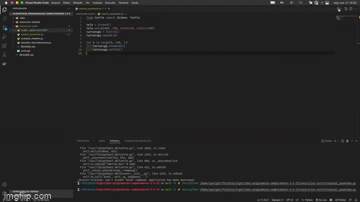

# 🐢 Gráficos Turtle

## Alguns métodos e usos do módulo Turtle 

- pointer = turtle.Turtle() - cria instância da classe Turtle, que seria a 'caneta'
- turtle.Screen() - é usado para criar um tela
- pointer.speed() - define a velocidade, onde 6 seria o valor normal.
- pointer.color() - define um cor para o ponteiro, que pode ser por string (white, blue, etc), por hexadecimal ou por três parâmetros do tipo (r, g, b)
- pointer.shape() - define uma forma para o ponteiro
- pointer.pendown() - desenha enquanto se move 
- pointer.penup() - não desenha enquanto se move ("levanta a caneta"

## Exemplos com códigos comentados em português
- [Exemplo da documentação ](https://github.com/Univesp-Computacao/algoritmos-programacao-computadores-I-e-II/blob/main/exercicios-turtle/exemplo-documentacao.py)
- [Exemplo do README](https://github.com/Univesp-Computacao/algoritmos-programacao-computadores-I-e-II/blob/main/exercicios-turtle/example_readme.py)

## TKinter
Importante checar se o Tkinter está instalado em sua máquina.

Confira a documentação do TKDocs: https://tkdocs.com/index.html

## Referências

- [Documentação oficial](https://docs.python.org/pt-br/3/library/turtle.html) 
- [Acervo Lima - muitos exemplos](https://acervolima.com/tutorial-da-tartaruga-python/) 
- [Turtle Examples](https://michael0x2a.com/blog/turtle-examples) 
